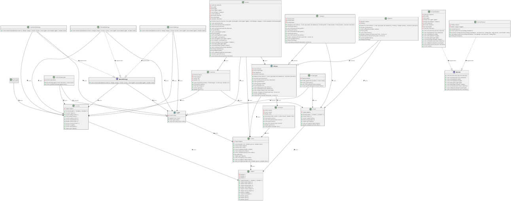

# SAE 3.A.01

## Test the project

The project version is java 20.

You can test the project in 2 different ways :

1. First way : 
 - Get the bash script 'scriptMain.sh' in the scripts folder at the root of the project as well as the jar file 'saeMain.jar'. 
 - Put them in the same folder; in a terminal go to this folder and run the command : ```bash scriptMain.sh [test.txt]```

This first way will carry out the tests with the Main branch of our project. 
In this main branch there are all the features that work perfectly.

Features that work perfectly :

 - Showing all shapes.  
 - Basic shape without any lights.  
 - Lambert algorithm on every shapes.  
 - Blinn-Phong algorithm on every shapes.


2. Second way : 
 - Get the bash script 'scriptMain2.sh' in the scripts folder at the root of the project as well as the jar file 'saeMain2.jar'.
 - Put them in the same folder, in a terminal go to this folder and run the command : ```bash scriptMain2.sh [test.txt]```


This second way will carry out the tests with the Main2 branch of our project.
In this Main2 branch there are all the features that work perfectly and the features that work but not totally.

Features with bugs are :

 - the shadows, they create bugs on the triangles.
 - The reflection, when it takes place, the lights on the reflections are missing.
 - The checkerboard is present but there is a place where the checkerboard is not done.

## The report

https://gitlab.univ-artois.fr/thomas_darcheville/sae-3.a.01/-/blob/main/RAPPORT.md?ref_type=heads

## Task evaluation
1. Breakdown of the specifications into main tasks of development project:
    - **Task 1**: Manipulation of numerical triplets (points, vectors, colors).
    - **Task 2**: Reading text files representing 3D scenes.
    - **Task 3**: Generation of images with spheres in 2D.
    - **Task 4**: Taking into account diffuse light and light sources.
    - **Task 5**: Appearance of plane and triangle objects.
    - **Task 6**: Adding shadows and reflections.
    - **Task 7**: Procedural texture: checkerboard.
    - **Task 8**: Anti-aliasing.

## Project conventions
1. **Branch name:** *The branches must have the name of the corresponding task.*
2. **Comments, variable and function naming:** *IN ENGLISH!*
3. **Absolute rule:** *never push on the main branch !*

## Class diagram 

**UML code :**


@startuml
class Triplet {
  -double x
  -double y
  -double z
  +Triplet(double x, double y, double z)
  +Triplet add(Triplet t)
  +Triplet sub(Triplet t)
  +Triplet mul(double d)
  +double dot(Triplet t)
  +Triplet schur(Triplet t)
  +Triplet cross(Triplet t)
  +double length()
  +Triplet normalize()
  +double getX()
  +double getY()
  +double getZ()
}

class Vector {
  -Triplet triplet
  +Vector(double x, double y, double z)
  +Vector(Triplet t)
  +Vector add(Vector v)
  +Point add(Point p)
  +Vector sub(Vector v)
  +Vector mul(double d)
  +double dot(Vector v)
  +Vector cross(Vector v)
  +double length()
  +Vector normalize()
  +Triplet getTriplet()
}

class Point {
  -Triplet triplet
  +Point(double x, double y, double z)
  +Point(Triplet t)
  +Vector sub(Point p)
  +Point mul(double d)
  +Triplet getTriplet()
  +void setTriplet(Triplet triplet)
  +double distance(Point other)
}

class Color {
  -Triplet triplet
  +Color(double red, double green, double blue)
  +Color(Triplet triplet)
  +Color(Color color)
  +Color multiply(double scalar)
  +Color add(Color other)
  +Color schurProduct(Color other)
  +int getRGB()
  +Triplet getTriplet()
  +void setTriplet(Color color)
  +void setTriplet(Triplet triplet)
  +void setTriplet(double red, double green, double blue)
}

class Checker {
  -Color color1
  -Color color2
  -double size
  +Checker(Color color1, Color color2, double size)
  +Color getColor1()
  +void setColor1(Color color1)
  +Color getColor2()
  +void setColor2(Color color2)
  +double getSize()
  +void setSize(double size)
}

class Camera {
  -Point position
  -Point target
  -Vector up
  -double fov
  +Camera(Point position, Point target, Vector up, double fov)
  +Point getPosition()
  +Point getTarget()
  +Vector getUp()
  +double getFov()
}

abstract class Light {
  -Color color
  +Light(Color color)
  +Color getColor()
  +void setColor(Color color)
}

class DirectionalLight {
  -Vector direction
  +DirectionalLight(Vector direction, Color color)
  +Vector getDirectionalLightVector()
}
DirectionalLight --|> Light : extends >

class PointLight {
  -Point position
  +PointLight(Point position, Color color)
  +Point getPosition()
  +void setPosition(Point position)
  +Vector getPointLightVector(Point p)
}
PointLight --|> Light : extends >

interface ColorStrategy {
  +Color colorCalculation(Vector d, Shape shape, Scene scene, List<Light> accessibleLights, double mint)
}

class BasicStrategy {
  +Color colorCalculation(Vector d, Shape shape, Scene scene, List<Light> accessibleLights, double mint)
}
BasicStrategy ..|> ColorStrategy : implements >

class LambertStrategy {
  +Color colorCalculation(Vector d, Shape shape, Scene scene, List<Light> accessibleLights, double mint)
}
LambertStrategy ..|> ColorStrategy : implements >

class PhongStrategy {
  +Color colorCalculation(Vector d, Shape shape, Scene scene, List<Light> accessibleLights, double mint)
}
PhongStrategy ..|> ColorStrategy : implements >

abstract class Shape {
  -Color diffuse
  -Color specular
  -int shininess
  -Checker checker
  +Shape(Color diffuse, Color specular, int shininess, Checker checker)
  +Checker getChecker()
  +void setChecker(Checker checker)
  +Color getDiffuse()
  +Color getSpecular()
  +int getShininess()
  +void setDiffuse(Color diffuse)
  +void setShininess(int shininess)
  +void setSpecular(Color specular)
  +double distance(Point lookFrom, Vector d)
  +Vector getN(Point p)
  +Point intersection(Point point, Vector d)
}

class Triangle {
  -Point point1
  -Point point2
  -Point point3
  +Triangle(Color diffuse, Color specular, int shininess, Point point1, Point point2, Point point3, Checker checker)
  +Point getPoint1()
  +void setPoint1(Point point1)
  +Point getPoint2()
  +void setPoint2(Point point2)
  +Point getPoint3()
  +void setPoint3(Point point3)
  +double distance(Point lookFrom, Vector d)
  +Vector getN(Point p)
  +String toString()
  +Point intersection(Point point, Vector d)
}
Triangle --|> Shape : extends >

class Sphere {
  -double radius
  -Point p
  +Sphere(Color diffuse, Color specular, int shininess, Point p, double radius, Checker checker)
  +double getRadius()
  +void setRadius(double radius)
  +Point getP()
  +void setP(Point p)
  +double distance(Point lookFrom, Vector d)
  +Point intersection(Point point, Vector d)
  +Vector getN(Point p)
  +String toString()
}
Sphere --|> Shape : extends >

class Scene {
  -Camera camera
  -int width
  -int height
  -List<Light> lights
  -List<Shape> shapes
  -Color ambient
  -boolean shadow
  -int maxDepth
  -Checker checker
  +Scene(Camera camera, int width, int height, List<Light> lights, List<Shape> shapes, Color ambient, int maxDepth)
  +Color getAmbient()
  +void setAmbient(Color ambient)
  +Camera getCamera()
  +void setCamera(Camera camera)
  +int getWidth()
  +void setWidth(int width)
  +int getHeight()
  +void setHeight(int height)
  +List<Light> getLights()
  +void setLights(List<Light> lights)
  +List<Shape> getShapes()
  +void setShapes(List<Shape> shapes)
  +void addLight(Light light)
  +void addShape(Shape shape)
  +void setShadow(boolean shadow)
  +boolean isShadow()
  +int getMaxDepth()
  +void setMaxDepth(int maxDepth)
  +Checker getChecker()
  +void setChecker(Checker checker)
}

interface Builder {
  +void setCamera(Camera camera)
  +void setAmbient(Color ambient)
  +void setWidth(int width)
  +void setHeight(int height)
  +void addLight(Light light)
  +void addShape(Shape shape)
  +void setShadow(boolean shadow)
  +void setMaxDepth(int maxDepth)
  +void setChecker(Checker checker)
}

class SceneBuilder {
  -Camera camera
  -int width
  -int height
  -ArrayList<Light> lights
  -ArrayList<Shape> shapes
  -Color ambient
  -boolean shadow
  -int maxDepth
  -Checker checker
  +void setCamera(Camera camera)
  +void setAmbient(Color ambient)
  +void setWidth(int width)
  +void setHeight(int height)
  +void addLight(Light light)
  +void addShape(Shape shape)
  +void setShadow(boolean shadow)
  +void setMaxDepth(int maxDepth)
  +void setChecker(Checker checker)
  +Scene build()
}
SceneBuilder ..|> Builder : implements >

class SceneParser {
  -String output
  -static Logger logger
  +SceneParser()
  +Scene parseScene(String fileName)
  +boolean declaredVertex(String funcName, int numLine, String line, int[] check, List<Point> verts)
  +void argumentError(String funcName, int nbArgs, int numLine, String line)
  +String getOutput()
}
SceneParser ..|> Builder : implements >

Vector --> Triplet : uses >
Point --> Triplet : uses >
Color --> Triplet : uses >
Checker --> Color : uses >
Camera --> Point : uses >
Camera --> Vector : uses >
Light --> Color : uses >
DirectionalLight --> Vector : uses >
PointLight --> Point : uses >
SpotLight --> Vector : uses >
ColorStrategy --> Vector : uses >
ColorStrategy --> Light : uses >
PhongStrategy --> Vector : uses >
PhongStrategy --> Light : uses >
BasicStrategy --> Vector : uses >
BasicStrategy --> Light : uses >
LambertStrategy --> Vector : uses >
LambertStrategy --> Light : uses >
Shape --> Color : uses >
Shape --> Checker : uses >
Triangle --> Point : uses >
Sphere --> Point : uses >
Scene --> Camera : uses >
Scene --> Light : uses >
Scene --> Shape : uses >
Scene --> Color : uses >

@enduml
